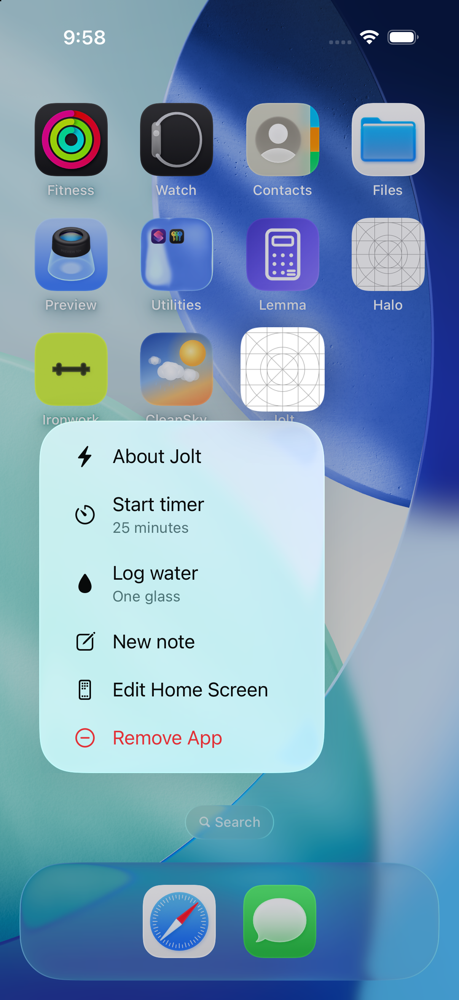
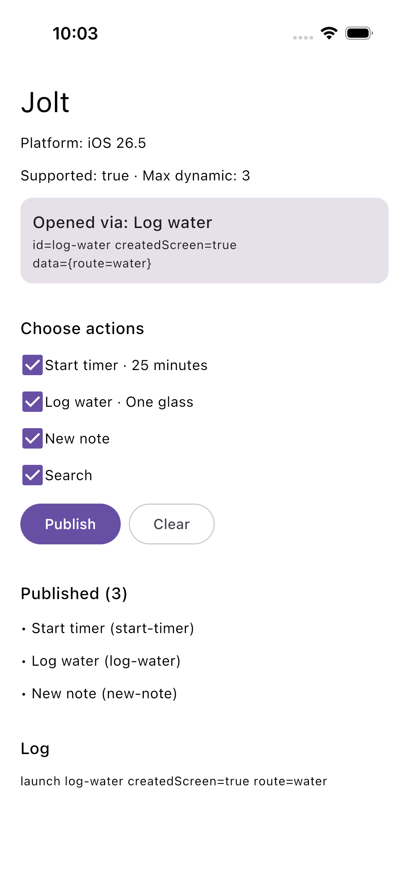
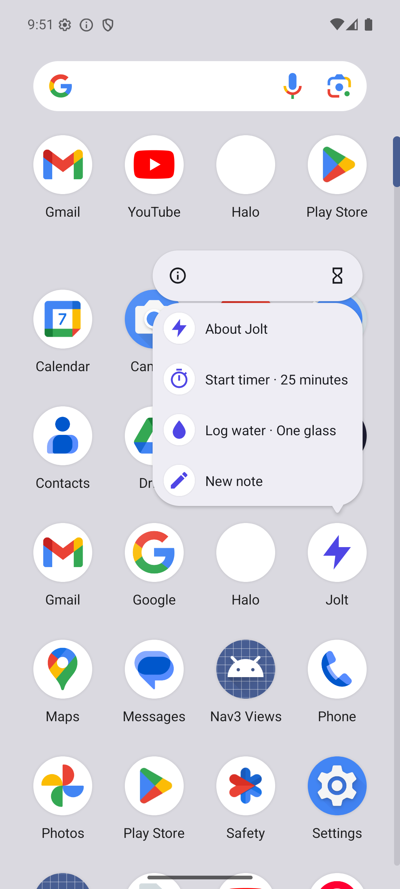
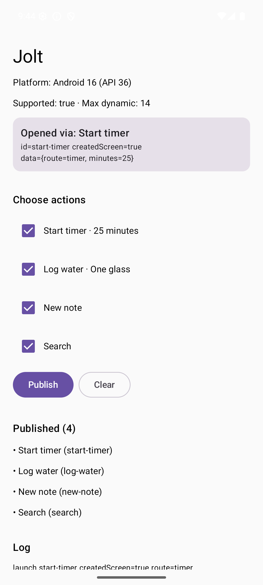

<h1 align="center">Jolt</h1>

<p align="center"><b>One API. Home-screen quick actions on iOS and Android.</b></p>

<p align="center">
  <a href="https://central.sonatype.com/artifact/io.github.androidpoet/jolt"></a>
  <a href="https://kotlinlang.org"></a>
  <a href="LICENSE"></a>
</p>

<p align="center">
  
  
  
  
  
</p>

<p align="center">
Publish the menu that appears when the user long-presses your app icon, and receive the tap,
from <code>commonMain</code>. iOS uses <b>UIApplicationShortcutItem</b>; Android uses
<b>ShortcutManagerCompat</b> dynamic shortcuts. The same <code>QuickAction</code> you published
comes back in the launch, on both platforms, whether the tap started the app or reached it running.
</p>

## Screenshots

<table align="center">
  <tr>
    <th>iOS Home Screen</th>
    <th>iOS launch received</th>
    <th>Android launcher</th>
    <th>Android launch received</th>
  </tr>
  <tr>
    <td></td>
    <td></td>
    <td></td>
    <td></td>
  </tr>
</table>

## Install

```kotlin
implementation("io.github.androidpoet:jolt:0.1.0")          // core API + platform managers
implementation("io.github.androidpoet:jolt-compose:0.1.0")  // rememberQuickActionsManager(), QuickActions(), OnQuickActionLaunch()
```

## Usage

```kotlin
val quickActions = rememberQuickActionsManager()

// Publish. Re-publishing an equal list is free, so this can live at the root of the UI.
QuickActions(
    listOf(
        QuickAction("start-timer", "Start timer", subtitle = "25 minutes", icon = "timer", data = mapOf("route" to "timer")),
        QuickAction("log-water", "Log water", icon = "drop.fill", data = mapOf("route" to "water")),
    ),
    quickActions,
) { result -> if (result is QuickActionsResult.Failure) log(result.error.code, result.error.message) }

// Receive. One place, at the root; the launch that started the app is buffered until this runs.
OnQuickActionLaunch(quickActions) { launch ->
    navigate(launch.action.data["route"])
    quickActions.reportUsed(launch.action.id)
}
```

Without Compose, use the platform class directly (`AndroidQuickActionsManager`, `IosQuickActionsManager`)
and collect `manager.launches`.

`launch.createdScreen` is `true` when the tap created the screen (Android `onCreate`, iOS scene connect)
and `false` when it reached a screen already showing.

## Platforms

| Platform | Surface | Floor | One-time setup |
| --- | --- | --- | --- |
| Android | Launcher long-press menu (dynamic shortcuts) | API 26 | None with Compose; otherwise one call in your Activity (below) |
| iOS | Home Screen quick actions | iOS 13 | Copy one Swift file and adopt its app delegate (below) |
| JVM, macOS, Wasm | `UnsupportedQuickActionsManager` so shared code compiles | — | — |

### Android

```kotlin
Jolt.androidConfig =
    AndroidQuickActionsConfig(
        defaultIconRes = R.drawable.ic_bolt,
        iconResolver = { key -> if (key == "timer") R.drawable.ic_timer else 0 },
    )
```

Icons are resolved through `iconResolver` at compile time, never by resource name, so shrunk release
builds keep working. Shortcuts open your launcher Activity (or `targetActivity`) with `Jolt.ACTION`
and the encoded action in `Jolt.EXTRA_ACTION`.

**Delivery.** `rememberQuickActionsManager()` calls `Jolt.attach(activity)` for you. Without Compose,
call it once in `onCreate` of a `ComponentActivity`; for a plain `Activity`, call
`Jolt.handleLaunchIntent(intent, savedInstanceState)` in `onCreate` and `Jolt.handleNewIntent(intent)`
in `onNewIntent`. `attach` dispatches the launch intent once per Activity lifetime, ignores relaunches
from Recents, and drops launches whose id is not a shortcut the platform knows for your app.

Static shortcuts in `shortcuts.xml` are delivered too when their intent uses `Jolt.ACTION` and carries
`Jolt.EXTRA_ACTION` with the action JSON (`{"id":"about","title":"About"}`).

`AndroidQuickActionsManager` adds `isRateLimited`, `canPin` and `requestPin(id)`.

### iOS

UIKit hands quick actions to the app delegate, which Kotlin cannot own, so one Swift file bridges it:

1. Copy `swift/JoltDelegates.swift` into the app target and point its `import` at your Kotlin framework.
2. Adopt it: `@UIApplicationDelegateAdaptor(JoltAppDelegate.self) var delegate` in your SwiftUI `App`,
   or forward the three calls from your own delegates.
3. Export the library from your framework so Swift sees `Jolt` by name:

```kotlin
binaries.framework { export(project(":jolt")) }   // plus api(...) in commonMain
```

`icon` is an SF Symbol name. The Home Screen shows four items in total, static `Info.plist` items first,
so `maxActions` is four minus the static count.

## Things to know

- **Four visible slots.** Both home screens display about four items including static ones. Android
  accepts more (`maxActions` is usually 14) but hides the rest; iOS rejects the fifth with `TooManyActions`.
- **Android long label.** Launchers show the long label when it fits, so the subtitle is appended to the
  title (`Start timer · 25 minutes`) rather than replacing it.
- **Untrusted `data`.** The payload travels through an exported Activity. Use it to pick a route; never
  execute it as a URL or command.
- **One collector.** Each launch is delivered to exactly one collector of `launches`. Collect at the root.
- **Rate limiting.** Android refuses shortcut changes from a backgrounded app; you get `RateLimited`.
  Publishing an equal list short-circuits before that check.
- **Pinned and static items** can arrive in `launches` with ids that are not in `actions`.

### Troubleshooting

| Symptom | Cause |
| --- | --- |
| Actions publish but taps never arrive | Delivery not wired: `Jolt.isDeliveryInstalled` is `false`. Android: call `Jolt.attach`. iOS: adopt `JoltAppDelegate`. |
| iOS: `TooManyActions` with four items | Static `Info.plist` items count against the four slots. |
| Android: the same launch arrives twice | You call both `attach` and `handleLaunchIntent`. Use one. |
| Android: menu shows the subtitle only | Fixed in 0.1.0; the long label keeps the title. |

## Sample

`sample/composeApp` is one shared screen: pick actions, publish, and watch launches arrive. Android:
`./gradlew :sample:composeApp:installDebug`. iOS: `cd sample/composeApp/iosApp && xcodegen && open iosApp.xcodeproj`.

## License

MIT © Ranbir Singh
